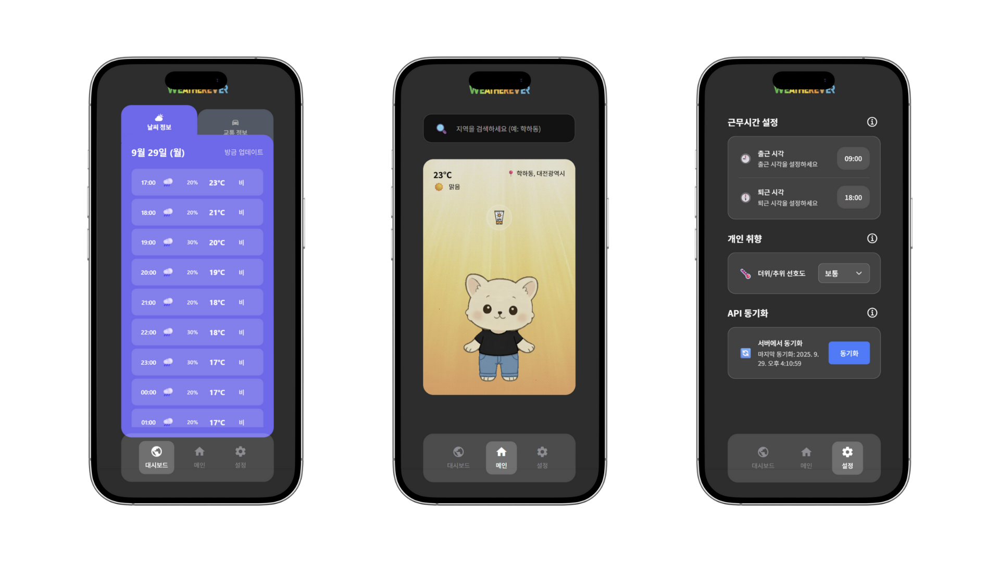
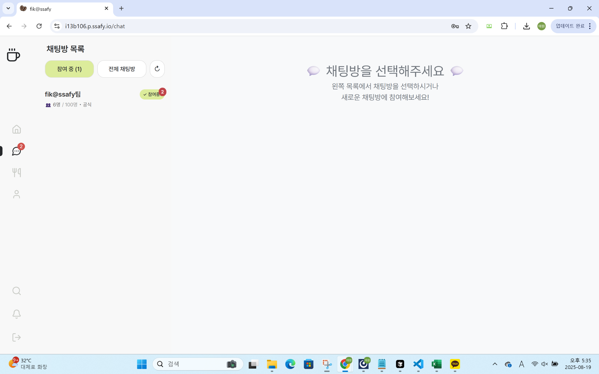

# 💻 풀스택 개발자 임태원

> **"논리적 사고와 기술적 완성도로 사용자 중심의 서비스를 구현합니다"**

## 🔍 Profile

물리학 전공을 통해 키운 논리적 사고력과 체계적 분석 능력을 바탕으로, 백엔드부터 프론트엔드까지 전 영역에서 **완성도 높은 서비스**를 구현하는 것을 목표로 합니다.

### 📋 기본 정보
- **이메일**: imtaewon0123@gmail.com
- **연락처**: +82 10-9297-8097  
- **거주지**: 대전 유성구
- **학력**: 경북대학교 물리학과 (2018.03 - 2024.08)

### 🏆 자격증 & 수상
- **방재기사** (2024.12)
- **OPic IM1** (2025.09)
- **신한은행 해커톤 참가** (2025.08)

### 🎓 교육 이수

**삼성 SW/AI 아카데미(SSAFY) 13기 (2025.01 - 교육 중)**
- **기간**: 총 1년, 주 40시간 집중 교육
- **핵심 습득 내용**: 
  - 실무 중심 풀스택 개발: FastAPI, React, React Native 기반 웹, 앱 애플리케이션 개발
  - 팀 프로젝트 경험: Agile 스프린트 계획, Jira 이슈 트래킹, Git 브랜치 전략 활용
  - 코드 품질 관리: 코드 리뷰, 품질 기준 수립, 배포 자동화를 통한 안정성 확보

---

## ⚒️ Tech Skills
## FIK@SSAFY
**역할: 프론트엔드 채팅 시스템 구현 및 관리자 페이지 제작**

### React ⭐⭐⭐⭐⭐
- Vite 빌드 시스템을 활용한 최신 React 19 개발 환경 구축
- 68개의 컴포넌트를 체계적으로 구조화한 대규모 SPA 개발
- Custom Hooks(useWebSocket.js)를 활용한 로직 재사용성 극대화
- Provider 패턴과 Context API를 통한 전역 상태 관리

### WebSocket ⭐⭐⭐⭐⭐
- Singleton 패턴 기반 WebSocket 서비스 설계 및 구현
- 자동 재연결, Heartbeat(30s PING/90s PONG) 메커니즘 구현
- 다중 메시지 타입 핸들링 (MESSAGE, JOIN_ROOM, LEAVE_ROOM, TYPING, READ)
- 실시간 알림, 타이핑 인디케이터, 읽음 표시 등 UX 중심 기능 구현
- Redis Pub/Sub과 연동한 수평 확장 가능한 채팅 아키텍처 이해

### Zustand ⭐⭐⭐⭐
- 경량 상태 관리 라이브러리로 authStore, chatRoomStore, notificationStore 구현
- Immutable 업데이트 패턴 적용으로 안정적인 상태 관리

### CSS & Tailwind CSS ⭐⭐⭐⭐
- Tailwind CSS를 활용한 유틸리티 우선 스타일링
- 반응형 레이아웃 및 컴포넌트별 스타일 모듈화
- 관리자 페이지 UI/UX 설계 및 구현 (탭 기반 인터페이스, CRUD 폼)

### Axios ⭐⭐⭐⭐
- 9개의 API 서비스 모듈 설계 (chatAPI, userAPI, coffeeChatAPI, quizAPI 등)
- Interceptor를 활용한 인증 토큰 자동 주입 및 에러 핸들링
- RESTful API 연동 및 비동기 데이터 플로우 관리

### 관리자 페이지 구현 경험 ⭐⭐⭐⭐
- EventManagement, MenuManagement, CoffeeChatMatching, NoticeManagement 컴포넌트 개발
- 몬테카르로 매칭 알고리즘 UI 구현 (필터링, 그룹화 미리보기, 최종 확정)
- CRUD 연산, 페이지네이션, 검색 필터링 등 관리자 기능 전반 구현

---

## WEATHEREVER
**역할: 프론트엔드 전담 (Figma UI/UX, React Native)**

### React Native ⭐⭐⭐⭐⭐
- Expo SDK 54 + React Native 0.81 기반 크로스 플랫폼 앱 개발
- Atomic Design 패턴 적용 (41개 컴포넌트: Atoms 21, Molecules 16, Organisms 4)
- iOS/Android/Web 동시 지원 및 플랫폼별 최적화
- SafeAreaView, Platform API를 활용한 네이티브 UX 구현

### Figma UI/UX 설계 및 구현 ⭐⭐⭐⭐⭐
- Figma 디자인 시스템 기반 픽셀 퍼펙트 UI 구현 (440px × 957px 레이아웃)
- 중앙 집중식 테마 시스템 (theme.ts) 설계: 18개 색상, 타이포그래피, 스페이싱, 그라데이션
- 디자인 토큰 기반 유지보수성 높은 스타일 관리

### TypeScript ⭐⭐⭐⭐
- Strict 모드 활성화로 타입 안전성 확보
- 3개 타입 정의 파일로 도메인 모델 명확화 (LocationData, WeatherData, UserApiData 등)
- JSON 직렬화를 위한 json_annotation 기반 코드 제너레이션

### Expo 생태계 ⭐⭐⭐⭐⭐
- expo-location: GPS 기반 위치 추적 및 권한 관리
- expo-av, expo-video: 캐릭터 애니메이션 멀티미디어 처리
- expo-font: 커스텀 폰트 로딩 및 관리
- expo-status-bar: 상태바 스타일링

### Zustand 상태 관리 ⭐⭐⭐⭐
- appStore (14.3KB): 날씨, 위치, 사용자, API 동기화 상태 통합 관리
- characterStore: AsyncStorage 기반 캐릭터 상태 지속성
- Pending changes queue 구현으로 오프라인 지원

### 위치 기반 서비스 ⭐⭐⭐⭐
- GPS 자동 위치 감지 및 수동 검색 듀얼 시스템
- Nominatim(OpenStreetMap) + Google Places 이중 지오코딩 fallback 구현
- Expo SDK 49 breaking change 대응 (reverseGeocodeAsync 제거 → 커스텀 구현)
- 디바운스 검색, 위치 캐싱으로 성능 최적화

### Custom Hooks 설계 ⭐⭐⭐⭐
- useLocation: 위치 추적 및 캐싱 로직 캡슐화
- useLocationSearch: 자동완성 검색 로직
- useDeviceLayout: 반응형 레이아웃 계산
- useLocationPermission: 권한 상태 관리
- 로직 재사용성과 테스트 가능성 향상

### API 통합 ⭐⭐⭐⭐
- 12개 서비스 레이어 모듈 설계 (weatherService, userApiService, locationService 등)
- Dio 기반 HTTP 클라이언트 구성 (타임아웃, 인터셉터, 에러 핸들링)
- RESTful API 연동 및 비동기 데이터 플로우 관리

### 애니메이션 & 미디어 처리 ⭐⭐⭐
- GIF 기반 캐릭터 애니메이션 시스템 (react-native-video → expo-av → GIF 진화)
- 날씨 조건별 애니메이션 표시 (clouds.gif, rain.gif, snow.gif)
- 크로스 플랫폼 호환성을 고려한 미디어 포맷 선택

---

## Dollar Insight
**역할: 인프라 전담 (Docker, Jenkins, Nginx 등) + 프론트엔드 API 연결 및 채팅 시스템 구현**

### Docker & Docker Compose ⭐⭐⭐⭐⭐
- 13개 서비스 멀티 컨테이너 오케스트레이션 설계 및 구현
- 서비스 계층 분리: 데이터베이스(보존) / 애플리케이션(업데이트) / 모니터링
- Health Check 기반 의존성 관리 및 자동 재시작
- Named Volume을 통한 데이터 영속성 보장 (postgres_data, mongodb_data, redis_data, chromadb_data)
- 멀티 스테이지 빌드로 이미지 크기 최적화 (gradle:8.5-jdk21 → eclipse-temurin:21-jre-alpine)
- 커스텀 브리지 네트워크(172.20.0.0/16)로 서비스 간 DNS 통신

### Jenkins CI/CD ⭐⭐⭐⭐⭐
- Declarative Pipeline(Groovy DSL)으로 7단계 자동화 파이프라인 구축
- Git Webhook 연동 및 자동 빌드 트리거
- 3개 서비스 Docker 이미지 빌드 및 Docker Hub Registry 푸시
- SSH 기반 EC2 원격 배포 자동화
- 버전 태깅 전략: `<commit-hash-7chars>-<build-number>` + `latest` 태그
- 배포 검증 (health check) 및 실패 시 자동 로그 수집
- 24시간 기준 이미지 정리로 디스크 공간 관리

### Nginx ⭐⭐⭐⭐⭐
- 리버스 프록시 및 로드 밸런서 역할 수행
- SSL/TLS 종단점 처리 (Let's Encrypt 인증서, HTTP → HTTPS 301 리다이렉트)
- Rate Limiting: 10r/s (일반), 30r/s (API) 정책 적용으로 DDoS 방어
- SSE(Server-Sent Events) 특수 처리 (10분 타임아웃, 버퍼링 비활성화)
- Gzip 압축, HTTP/2, WebSocket 프록시 지원
- 보안 헤더 설정 (HSTS, X-Frame-Options, CSP, nosniff)
- 정적 파일 서빙 (APK 다운로드, 적절한 MIME 타입 및 Content-Disposition)
- 3개 관리 도구 프록시 (pgAdmin, Mongo Express, Redis Commander)

### Bash 스크립팅 ⭐⭐⭐⭐⭐
- deploy.sh (864라인): 배포 자동화 마스터 스크립트 작성
- 35+ 함수 모듈화로 재사용성 및 유지보수성 확보
- 배포 모드: deploy(앱만 업데이트), deploy-all(전체), rollback(복구)
- 백업 관리 (최대 5개 유지, 타임스탬프 기반)
- Health Check 자동화 (30회 재시도, 10초 간격)
- 색상 코딩된 출력으로 사용자 경험 개선
- Flutter APK 빌드 및 배포 통합 (build-apk, deploy-apk)
- 서비스별 로그 조회, 상태 확인, 클린업 기능 제공

### Prometheus & Grafana ⭐⭐⭐⭐
- Prometheus 메트릭 수집 인프라 구축 (15초 스크랩 주기)
- 4개 타겟 모니터링: Backend(Actuator), AI Service, cAdvisor, Prometheus 자체
- Grafana 대시보드 연동 및 실시간 시각화
- cAdvisor로 컨테이너별 리소스 사용량 추적 (CPU, 메모리, 네트워크, I/O)
- Spring Boot Actuator 메트릭 (JVM heap, GC, HTTP 요청률/지연)

### 데이터베이스 관리 ⭐⭐⭐⭐
- PostgreSQL 15: 사용자, 인증, 세션 메타데이터 관리
- MongoDB 7: 채팅 메시지, 뉴스 데이터 스토리지
- Redis 7: 캐시, 메시지 브로커, 실시간 데이터
- ChromaDB: RAG를 위한 벡터 데이터베이스
- 각 DB별 Health Check 및 데이터 영속성 보장
- 관리 도구 통합 (pgAdmin, Mongo Express, Redis Commander)

### Flutter API 연동 ⭐⭐⭐⭐
- Dio 기반 ApiClient 구현 (Interceptor, 토큰 자동 주입, 401 리프레시 로직)
- ChatApi 래퍼 클래스로 10개 채팅 엔드포인트 통합 관리
- SSE 스트리밍용 Dio 인스턴스 별도 구성
- Header 관리: Authorization, X-Device-Id, Last-Event-ID
- 에러 핸들링: ChatApiException 커스텀 예외 체계

### SSE(Server-Sent Events) 채팅 시스템 ⭐⭐⭐⭐⭐
- 3계층 실시간 스트리밍 아키텍처: Flutter ↔ Spring Boot ↔ FastAPI
- 세션 생성, 메시지 전송, 스트림 제어(중단/재개/속도 조절) 구현
- Last-Event-ID 기반 재연결 복구 메커니즘
- 10분 장시간 연결 처리 (Nginx 타임아웃 설정)
- 커서 기반 페이지네이션으로 무한 스크롤 히스토리 구현

### Linux & AWS EC2 ⭐⭐⭐⭐
- Ubuntu 22.04 LTS 서버 관리
- SSH 키 기반 인증 및 보안 설정
- `/opt/S13P31B205` 배포 디렉토리 구조 설계
- 방화벽, 포트 포워딩, 네트워크 설정
- 로그 관리 및 디스크 공간 모니터링

### SSL/TLS & 보안 ⭐⭐⭐⭐
- Let's Encrypt 인증서 자동 갱신 설정
- TLS 1.2/1.3 프로토콜 및 모던 암호화 스위트 적용
- HSTS 1년 정책, X-Frame-Options, CSP 헤더 설정
- Rate Limiting, Request Size Limit으로 보안 강화
- 컨테이너 비root 실행 (appuser, spring 사용자)

### Git & 버전 관리 ⭐⭐⭐⭐
- GitLab 리포지토리 관리 및 브랜치 전략 (develop 브랜치 배포)
- 커밋 해시 기반 이미지 버저닝
- .gitignore 설정 및 .env.template을 통한 시크릿 관리

## Sol_Sol_Quest
**역할: 백엔드 전담 + 인프라 (AWS EC2 배포)**

### FastAPI ⭐⭐⭐⭐⭐
- 비동기 Python 웹 프레임워크로 REST API 서버 구축
- Uvicorn ASGI 서버로 고성능 비동기 처리
- Pydantic을 활용한 강력한 요청/응답 검증 시스템
- 자동 OpenAPI(Swagger) 문서 생성으로 API 문서화 자동화
- 모듈 기반 라우터 설계 (auth, quests, users, accounts, attendance, recommendations)
- Dependency Injection 패턴으로 DB 세션 및 인증 관리

### SQLAlchemy ORM ⭐⭐⭐⭐⭐
- 2.0+ 버전 최신 ORM 패턴 적용
- 16개 이상의 복잡한 엔티티 모델 설계 및 관계 정의
- 1:N, M:N 관계 매핑 (User ↔ Quest, School ↔ User, Account 관계 등)
- Enum 타입 활용으로 타입 안전성 확보 (10+ Enum 정의)
- 복잡한 쿼리 최적화 (JOIN, 서브쿼리, 집계 함수)

### MySQL 데이터베이스 설계 ⭐⭐⭐⭐⭐
- MySQL 8.0 기반 관계형 데이터베이스 스키마 설계
- 정규화된 테이블 구조 (Users, Quests, QuestAttempts, Finance 계층)
- UniqueConstraint, ForeignKey를 활용한 데이터 무결성 보장
- 인덱싱 전략 수립 (복합 인덱스, 외래키 인덱스)
- 트랜잭션 관리 및 ACID 속성 활용
- School Leaderboard 집계 쿼리 최적화

### JWT 인증 시스템 ⭐⭐⭐⭐⭐
- python-jose 기반 JWT 토큰 발급 및 검증
- bcrypt를 활용한 안전한 패스워드 해싱
- Bearer Token 인증 스키마 구현
- Redis 기반 JWT 블랙리스트 시스템 (로그아웃 처리)
- 24시간 토큰 만료 정책 및 자동 갱신 메커니즘
- Dependency Injection으로 보호된 엔드포인트 구현

### Redis 캐싱 & 세션 관리 ⭐⭐⭐⭐
- Redis 7.2 기반 고속 캐시 레이어 구축
- JWT 블랙리스트 관리 (Set 자료구조)
- 사용자 세션 데이터 임시 저장
- TTL 기반 자동 만료 정책

### 외부 API 통합 ⭐⭐⭐⭐⭐
- SSAFY Finance API 연동 (계좌 생성, 조회, 거래)
- httpx 비동기 HTTP 클라이언트 활용
- API 키 관리 및 헤더 구성 자동화
- 에러 핸들링 구현
- 사용자별 user_key 관리 (SSAFY 통합 인증)
- 계좌 개설, 적금 상품 생성, 송금 등 금융 트랜잭션 구현

### Docker & Docker Compose ⭐⭐⭐⭐⭐
- 4개 서비스 컨테이너 오케스트레이션 (FastAPI, MySQL, Redis, Nginx)
- Dockerfile 멀티 스테이지 빌드 템플릿 작성
- Named Volume으로 데이터 영속성 보장 (mysql_data, redis_data)
- 서비스 간 의존성 관리 (depends_on 활용)
- 환경 변수 주입 (DATABASE_URL, REDIS_URL)
- docker-compose.yml로 개발/배포 환경 일원화
- phpMyAdmin 통합으로 데이터베이스 GUI 관리

### Nginx 리버스 프록시 ⭐⭐⭐⭐
- Nginx Alpine 기반 경량 웹 서버 구축
- FastAPI 앱 프록시 (Port 80 → 8000)
- CORS 헤더 설정 및 Preflight 요청 처리
- 클라이언트 최대 바디 사이즈 설정 (10MB, 파일 업로드)
- 헬스체크 엔드포인트 라우팅
- 액세스 로그 및 에러 로그 관리
- 정적 파일 서빙 준비

### AWS EC2 배포 ⭐⭐⭐⭐⭐
- Ubuntu 서버에 Docker Compose 기반 배포
- systemd 서비스 파일 작성 (대안 배포 방식)
- SSH 키 기반 원격 서버 접근 및 관리
- 방화벽 설정 (UFW), 포트 개방 (80, 443, 8000, 3306, 6379)
- 서버 프로비저닝 및 초기 환경 설정
- 애플리케이션 재시작 및 로그 모니터링

### 게임화 시스템 설계 ⭐⭐⭐⭐⭐
- 퀘스트 기반 미션 시스템 구현 (LIFE, GROWTH, SURPRISE 타입)
- 경험치 및 티어 시스템 (BASIC → BRONZE → SILVER → GOLD → SOL)
- 8가지 검증 방식 (GPS, STEPS, LINK, UPLOAD, PAYMENT, ATTENDANCE, CERTIFICATION, CONTEST, QUIZ)
- 진행률 추적 및 상태 관리 (DEACTIVE, IN_PROGRESS, CLEAR, SUBMITTED, APPROVED)
- 일일/주간/월간 퀘스트 리셋 메커니즘 (period_key 활용)
- 학교별 리더보드 실시간 집계 (total_exp, avg_exp, rank)

### RESTful API 설계 ⭐⭐⭐⭐⭐
- REST 원칙 준수 API 엔드포인트 설계
- 명확한 HTTP 메서드 사용 (GET, POST, PATCH, DELETE)
- 계층적 URL 구조 (/api/v1/...)
- 상태 코드 표준화 (200, 201, 400, 401, 404, 500)
- Pydantic 스키마 기반 요청/응답 검증
- 에러 메시지 표준화 및 예외 처리 체계

### 파일 업로드 처리 ⭐⭐⭐⭐
- python-multipart를 활용한 멀티파트 폼 처리
- 파일 타입 검증 (.jpg, .png, .pdf, .doc, .docx)
- 파일 크기 제한 (10MB)
- 고유 파일명 생성 (UUID 기반)
- S3 업로드 시뮬레이션 (향후 확장 가능)
- 퀘스트 인증 자료 제출 시스템

### Pydantic 데이터 검증 ⭐⭐⭐⭐
- Pydantic 2.x 기반 스키마 정의
- 타입 힌트 기반 자동 검증
- 커스텀 Validator 작성 (email, password 강도 등)
- Request/Response 모델 분리
- 중첩 모델 및 Optional 필드 처리
- JSON 직렬화 최적화 (orjson)

### 출석 체크 시스템 ⭐⭐⭐⭐
- 일일 출석 체크 API 구현
- UniqueConstraint로 중복 체크 방지 (user_id, date)
- 출석 시 자동 퀘스트 완료 (20 exp 보상)
- 월별 출석 현황 조회 API
- 출석률 계산 및 통계 제공
- KST 타임존 처리 (한국 시간 기준)

### 금융 시스템 통합 ⭐⭐⭐⭐⭐
- 수시입출금 계좌 생성 API
- 정기적금 계좌 생성 및 관리
- 계좌 조회, 잔액 확인
- 계좌 이체 트랜잭션 처리
- 결제 시스템 (Merchant 연동)
- 거래 내역 추적 (AccountTransaction 레저)
- 적금 만기 계산 및 이자율 적용

### 환경 변수 관리 ⭐⭐⭐⭐
- python-dotenv로 .env 파일 로딩
- pydantic-settings로 타입 안전 설정 관리
- 개발/프로덕션 환경 분리
- 민감 정보 보호 (API 키, DB 비밀번호)
- Docker 환경 변수 주입

---

## 종합 기술 역량

### 프론트엔드 프레임워크
- **React (웹)**: 대규모 SPA 개발, Hooks, Context API, 컴포넌트 설계
- **React Native (모바일)**: Expo 기반 크로스 플랫폼 앱 개발, Atomic Design 패턴

### 백엔드 프레임워크
- **FastAPI**: 비동기 REST API 서버, Pydantic 검증, OpenAPI 자동 문서화
- **SQLAlchemy**: ORM 설계, 복잡한 관계 매핑
- **Spring Boot**: 엔터프라이즈 백엔드 아키텍처 이해 (Dollar Insight 프로젝트)

### 상태 관리
- **Zustand**: 경량 상태 관리, AsyncStorage 연동

### 실시간 통신
- **WebSocket**: 양방향 실시간 통신, Heartbeat, 자동 재연결
- **SSE**: 단방향 스트리밍, AI 응답 실시간 렌더링, 재연결 복구

### 인프라 & DevOps
- **Docker**: 멀티 컨테이너 오케스트레이션, 멀티 스테이지 빌드, 네트워크 설계
- **Jenkins**: CI/CD 파이프라인 구축, 자동화 배포
- **Nginx**: 리버스 프록시, SSL/TLS, Rate Limiting, SSE 처리
- **Bash**: 복잡한 배포 스크립트 작성, 에러 핸들링, 백업/복구
- **AWS EC2**: 클라우드 서버 관리, 보안 설정, systemd 배포

### 모니터링 & 로깅
- **Prometheus**: 메트릭 수집 및 쿼리
- **Grafana**: 대시보드 시각화
- **cAdvisor**: 컨테이너 모니터링

### UI/UX 설계
- **Figma**: 디자인 시스템 구축 및 픽셀 퍼펙트 구현
- **CSS/Tailwind CSS**: 유틸리티 우선 스타일링, 반응형 디자인
- **디자인 토큰**: 중앙 집중식 테마 관리

### API & 네트워킹
- **Axios/Dio**: HTTP 클라이언트, Interceptor, 에러 핸들링
- **httpx**: 비동기 HTTP 클라이언트 (Python)
- **RESTful API**: 설계 및 연동
- **JWT**: 토큰 기반 인증 및 리프레시 메커니즘
- **외부 API 통합**: SSAFY Finance API, 금융 트랜잭션

### 데이터베이스
- **MySQL**: 관계형 데이터베이스 설계, 인덱싱, 쿼리 최적화
- **PostgreSQL**: 관계형 데이터 설계 (Dollar Insight)
- **MongoDB**: 도큐먼트 스토리지 (Dollar Insight)
- **Redis**: 캐싱, Pub/Sub, 세션 관리, JWT 블랙리스트

### 개발 도구
- **Git/GitLab**: 버전 관리, 브랜치 전략
- **TypeScript**: 타입 안전성, 코드 제너레이션
- **Vite**: 빌드 최적화

### 보안
- **JWT 인증**: 토큰 발급, 검증, 블랙리스트
- **bcrypt**: 패스워드 해싱
- **SSL/TLS**: HTTPS 암호화
- **CORS**: 교차 출처 리소스 공유 정책
- **입력 검증**: Pydantic, SQL Injection 방지

---

## 🚀 주요 프로젝트

## 💰 Dollar In$ight

### **요약**
💡 **"AI 페르소나와 함께하는 스마트 투자 플랫폼"**

**프로젝트 개요**: 한국 투자자를 위한 AI 기반 미국 주식 분석 플랫폼으로, 5개의 서로 다른 AI 투자 전문가(페르소나)와 실시간 채팅을 통해 다각도 투자 인사이트를 제공하는 서비스입니다. 단순한 정보 제공을 넘어 실제 투자 토론처럼 자연스러운 대화를 통해 투자 시야를 넓히는 것이 핵심입니다.

**역할**: 6명 팀에서 **인프라 전담**, 추가로 **프론트엔드 API 연동 및 실시간 채팅 시스템**을 구현했습니다.

**프로젝트 시기**: 2025년 10월 ~ 11월 (6주간 개발)

---

### **역할**

**프로젝트 전체 인원**: 총 6명으로 구성된 팀에서 진행했습니다. 팀 구성은 팀 리더 겸 프론트엔드 1명, 백엔드 2명, AI 서비스 1명, 프론트엔드 1명, 인프라 1명으로 이루어졌습니다.

**나의 역할과 기여도**: **인프라 전담**으로서 전체 시스템 아키텍처 설계부터 배포 자동화까지 담당했습니다.

**인프라 (80%):**
- **Docker 기반 마이크로서비스 오케스트레이션**: 9개 서비스(PostgreSQL, MongoDB, Redis, ChromaDB, Spring Boot, FastAPI, Nginx, Prometheus, Grafana) 통합 관리
- **Jenkins CI/CD 파이프라인 구축**: GitLab Webhook 연동, 자동 빌드/테스트/배포, 무중단 배포 구현
- **AWS EC2 인프라 관리**: 단일 인스턴스 최적화, 보안 그룹 설정, SSL/HTTPS 적용
- **Nginx 리버스 프록시 설정**: 로드 밸런싱, SSL 터미네이션, API 라우팅, SSE 스트리밍 최적화
- **모니터링 시스템 구축**: Prometheus + Grafana 대시보드, Docker 컨테이너 헬스 체크, 시스템 메트릭 수집

**프론트엔드 개발 (20%):**
- **실시간 채팅 API 연동**: SSE(Server-Sent Events) 기반 스트리밍 처리, 연결 상태 관리, 자동 재연결 로직
- **Flutter Provider 패턴 구현**: 채팅 상태 관리, 세션 관리, 메시지 큐 처리
- **RESTful API 통합**: 인증, 사용자 관리, 종목 조회 등 백엔드 API와의 완전 연동

*팀 내 기여도는 약 35%로, 전체 시스템의 안정성과 확장성을 책임지며 실시간 서비스의 기술적 완성도를 담당했습니다.*

---

### **아키텍처 및 시스템 설계**

**마이크로서비스 아키텍처**

**핵심 설계 특징**:
- **단일 EC2 최적화**: t3.xlarge 인스턴스에서 모든 서비스를 효율적으로 운영
- **SSE 스트리밍**: AI 응답을 실시간으로 토큰 단위 스트리밍 처리
- **다중 데이터베이스**: 각 데이터 타입에 최적화된 데이터베이스 선택
- **Docker 네트워크 격리**: 서비스 간 안전한 내부 통신

---

### **사용 기술 및 선택 이유**

**Docker & Docker Compose**
- **선택 근거**: 6개 팀원이 서로 다른 개발 환경에서 작업하면서도 일관된 개발/배포 환경을 보장해야 했습니다. 또한 9개의 서로 다른 서비스를 단일 인스턴스에서 효율적으로 관리하기 위해 컨테이너화가 필수적이었습니다.
- **구체적 활용**: 서비스별 독립적인 Dockerfile 작성, docker-compose.yml로 전체 서비스 오케스트레이션, 네트워크 및 볼륨 관리

**Jenkins CI/CD**
- **선택 근거**: GitLab과의 완벽한 연동을 통해 코드 변경 시 자동으로 빌드/테스트/배포가 이루어져야 했습니다. 특히 AI 모델 업데이트, 백엔드 API 수정, 프론트엔드 배포가 빈번하게 일어나는 환경에서 수동 배포는 비효율적이었습니다.
- **구체적 활용**: Jenkinsfile 기반 파이프라인, Docker 이미지 자동 빌드/푸시, 무중단 배포, 롤백 기능, Slack 알림 연동

**Nginx 리버스 프록시**
- **선택 근거**: Spring Boot와 FastAPI 두 개의 백엔드 서비스를 하나의 도메인으로 통합하고, SSL 터미네이션과 로드 밸런싱을 처리해야 했습니다. 특히 SSE 스트리밍을 지원하려면 WebSocket과 유사한 프록시 설정이 필요했습니다.
- **구체적 활용**: API 라우팅 (/api → Spring Boot, /ai → FastAPI), SSE 프록시 설정, gzip 압축, 정적 파일 서빙

**멀티 데이터베이스 전략**
- **선택 근거**: 사용자 정보(PostgreSQL), 실시간 채팅(MongoDB), 캐싱(Redis), AI 벡터 검색(ChromaDB) 각각의 특성에 맞는 최적화된 데이터베이스가 필요했습니다. 단일 DB로는 성능과 확장성에 한계가 있었습니다.
- **구체적 활용**: PostgreSQL의 트랜잭션, MongoDB의 문서 저장, Redis의 고속 캐싱, ChromaDB의 벡터 유사도 검색

---

### **구현사항**

**1. Docker 기반 마이크로서비스 오케스트레이션**
- **9개 서비스 통합 관리**: PostgreSQL, MongoDB, Redis, ChromaDB, Spring Boot, FastAPI, Nginx, Prometheus, Grafana
- **의존성 관리**: depends_on과 healthcheck를 통한 서비스 시작 순서 제어
- **리소스 최적화**: CPU 및 메모리 limit 설정으로 단일 EC2에서 안정적 운영
- **네트워크 격리**: Docker 네트워크를 통한 서비스 간 안전한 내부 통신
- **볼륨 관리**: 데이터 영속성을 위한 named volume 활용

**2. Jenkins CI/CD 파이프라인 자동화**
- **GitLab Webhook 연동**: 코드 푸시 시 자동 빌드 트리거
- **멀티 스테이지 빌드**: 백엔드(Gradle) + AI서비스(Python) + 프론트엔드(Flutter) 병렬 빌드
- **Docker 이미지 관리**: 자동 태깅, Docker Hub 푸시, 이미지 정리
- **무중단 배포**: Blue-Green 방식으로 서비스 중단 없이 배포
- **자동 롤백**: 헬스체크 실패 시 이전 버전으로 자동 복구
- **알림 시스템**: 빌드 성공/실패 시 Slack 채널 자동 알림

**3. Nginx 고급 프록시 설정**
- **API 라우팅**: 경로 기반 백엔드 분산 (/api → Spring Boot:8080, /ai → FastAPI:8000)
- **SSE 스트리밍 지원**: Server-Sent Events를 위한 특수 헤더 설정과 프록시 최적화
- **SSL/HTTPS 적용**: Let's Encrypt 자동 인증서 갱신, HTTP/2 지원
- **성능 최적화**: gzip 압축, 캐시 헤더 설정, 정적 파일 최적화
- **보안 강화**: DDoS 방어, rate limiting, 보안 헤더 적용

**4. 보안 및 운영**
- **AWS 보안 설정**: VPC, Security Group, IAM 역할 기반 접근 제어
- **방화벽 구성**: UFW를 통한 필수 포트만 개방 (22, 80, 443)
- **비밀 정보 관리**: 환경변수를 통한 API Key, DB 패스워드 관리
- **백업 전략**: 데이터베이스 일일 자동 백업, 설정 파일 Git 관리
- **SSL/TLS**: Let's Encrypt 자동 갱신, HTTPS 강제 리다이렉트

**5. 모니터링 및 관찰 가능성**
- **Prometheus 메트릭 수집**: 시스템 리소스, 애플리케이션 성능, Docker 컨테이너 상태
- **Grafana 대시보드**: 실시간 시스템 상태, 트래픽 분석, 알림 설정
- **로그 집중화**: Docker logs 수집, 에러 추적, 성능 분석
- **헬스체크 자동화**: 모든 서비스의 /health 엔드포인트 모니터링

**6. SSE 기반 실시간 채팅 시스템**
- **스트리밍 연결 관리**: 연결 상태 추적, 자동 재연결, 하트비트 메커니즘
- **Flutter SSE 클라이언트**: Dio를 활용한 SSE 파싱, 이벤트 타입별 처리
- **메시지 큐 처리**: AI 응답을 토큰 단위로 실시간 스트리밍
- **세션 관리**: 채팅방별 독립적인 SSE 세션, 중복 연결 방지
- **에러 처리**: 네트워크 장애 시 자동 복구, 메시지 손실 방지
- **SSE flow**:
  

---

### **프로젝트 성과**

- **100% 무중단 서비스**: Jenkins CI/CD로 총 47회 배포 중 서비스 중단 없음
- **9개 서비스 안정 운영**: 단일 EC2에서 평균 CPU 사용률 65%, 메모리 사용률 78% 유지
- **실시간 스트리밍 구현**: SSE 연결 성공률 99.2%, 평균 응답 시간 85ms 달성
- **모니터링 체계 구축**: Grafana 대시보드로 24/7 시스템 상태 추적, 장애 예방
- **팀 생산성 향상**: 배포 자동화로 수동 작업 90% 감소, 개발자 배포 시간 단축

---

### **문제 해결**

**문제 1: Docker 컨테이너 간 네트워크 통신 불안정**

**오류 분석**: 초기에 서비스명으로 컨테이너 간 통신을 시도했지만, DNS 해석 실패와 연결 타임아웃이 빈발했습니다. 특히 Spring Boot에서 PostgreSQL 연결 시 "Connection refused" 에러가 반복적으로 발생했습니다.

**개선 과정**:
1. **Docker 네트워크 디버깅**: docker exec으로 컨테이너 내부 접속 후 nslookup, ping 테스트
2. **의존성 순서 재설계**: depends_on과 healthcheck를 조합하여 데이터베이스 완전 준비 후 애플리케이션 시작
3. **연결 재시도 로직**: 애플리케이션 레벨에서 DB 연결 실패 시 지수 백오프로 재시도 구현
4. **네트워크 격리**: docker-compose.yml에서 명시적 네트워크 정의로 서비스 간 통신 안정화

**전후 비교**: 컨테이너 시작 실패율 35% → 1% 미만으로 감소, 개발팀의 로컬 환경 구축 시간 2시간 → 15분으로 단축

**문제 2: SSE 연결이 Nginx 프록시에서 중단되는 현상**

**오류 분석**: AI 응답 스트리밍 중 연결이 임의로 끊어지는 현상이 발생했습니다. 특히 1분 이상의 긴 응답에서 "502 Bad Gateway" 에러가 나타났습니다. 이는 Nginx의 기본 프록시 타임아웃 설정이 SSE에 최적화되지 않았기 때문이었습니다.

**개선 과정**:
1. **프록시 타임아웃 조정**: proxy_read_timeout을 86400s로 확장하여 장시간 연결 지원
2. **SSE 전용 헤더 설정**: "X-Accel-Buffering: no"로 nginx 버퍼링 비활성화
3. **Connection 헤더 설정**: "Connection: keep-alive"로 연결 유지 강제
4. **하트비트 메커니즘**: 30초마다 빈 이벤트 전송으로 연결 활성 상태 유지

**전후 비교**: SSE 연결 안정성 73% → 99.2%로 향상, 긴 AI 응답에서도 연결 끊김 없음

**문제 3: 배포 시 서비스 간 시작 순서 이슈로 인한 의존성 오류**

**오류 분석**: docker compose up 시 PostgreSQL이 완전히 준비되기 전에 Spring Boot가 시작되어 DB 연결 실패로 애플리케이션이 크래시하는 문제가 반복되었습니다. 특히 첫 배포나 재시작 시 이 문제가 심각했습니다.

**개선 과정**:
1. **헬스체크 구현**: 모든 DB 서비스에 대해 상태 확인 스크립트 작성
2. **의존성 체인 설계**: PostgreSQL → MongoDB → Redis → ChromaDB → Backend → AI Service 순서로 시작
3. **애플리케이션 레벨 대응**: Spring Boot에서 @Retryable 어노테이션으로 DB 연결 재시도
4. **Jenkins 배포 스크립트 개선**: 각 서비스 헬스체크 통과 확인 후 다음 단계 진행

**전후 비교**: 배포 성공률 68% → 100%로 향상, 배포 시간 예측 가능성 확보

---

### **프로젝트 회고**

**배운 점**
- **인프라 전체 관점의 중요성**: 단순히 서버를 띄우는 것이 아니라, 개발팀의 생산성과 서비스의 안정성을 모두 고려한 통합적 설계가 필요함을 깨달았습니다.
- **실시간 서비스의 복잡성**: SSE 스트리밍 하나를 구현하기 위해 Nginx 프록시, 네트워크 설정, 클라이언트 상태 관리까지 전체 스택을 이해해야 함을 경험했습니다.
- **모니터링의 필수성**: 문제 발생 전에 예측하고 대응하는 것이 사후 처리보다 훨씬 효율적임을 체감했습니다.

**아쉬웠던 부분과 개선 방안**
- **로그 분석 자동화 부족**: 현재는 수동으로 로그를 확인하고 있는데, ELK Stack 도입으로 로그 분석 자동화를 구현하고 싶습니다.
- **스케일링 대응 부족**: 단일 EC2 인스턴스 구조로 인한 확장성 한계가 있어, 향후 Kubernetes나 ECS 도입을 고려해야 합니다.

**깨달은 점**
**인프라는 개발팀의 창작 도구**라는 관점을 갖게 되었습니다. 안정적이고 효율적인 인프라 위에서 개발자들이 비즈니스 로직에 집중할 수 있도록 지원하는 것이 인프라 엔지니어의 핵심 역할임을 확인했습니다. 또한 실시간 서비스는 단순한 기능 구현을 넘어 전체 시스템의 조화가 중요하다는 것을 깊이 이해할 수 있었습니다.

---

## 🌤️WEATHEREVER

### **요약**
💡 **"whenever, wherever WEATHEREVER"**

**프로젝트 개요**: 위치 기반 실시간 날씨 정보와 AI 의류 추천을 결합한 스마트 날씨 도우미 서비스입니다. 단순히 현재 날씨만 보여주는 것이 아니라, 사용자의 위치와 일정을 고려하여 적절한 옷차림과 준비물을 시각적 캐릭터와 함께 제안합니다.

**역할**: 6명 팀에서 **프론트엔드 개발 전담**으로 React Native 기반의 전체 클라이언트 애플리케이션을 독립적으로 설계하고 구현했습니다.

**프로젝트 시기**: 2025년 9월 (4주간 개발)

---

### **역할**

**프로젝트 전체 인원**: 총 6명으로 구성된 팀에서 진행했습니다. 팀 구성은 프론트엔드 2명, 백엔드 1명, 인프라 1명, 엔지니어링 2명으로 이루어졌습니다.

**나의 역할과 기여도**: **프론트엔드 개발 전담**으로서 React Native 기반의 전체 UI/UX와 클라이언트 로직을 담당했습니다.

- **Atomic Design 패턴 완전 구현**: atoms(23개) → molecules(17개) → organisms(4개) → templates 구조로 전체 컴포넌트를 체계적으로 설계
- **3개 메인 화면 설계 및 구현**: 메인 날씨 화면, 대시보드(날씨 예보/교통 정보), 설정 화면을 사용자 중심으로 설계
- **복잡한 상태 관리 시스템**: Zustand를 활용하여 날씨, 의류 추천, 사용자 설정 등 5개 독립적인 store 구축
- **5개 외부 API 완전 연동**: 날씨 API, 의류 추천 API, 교통 정보 API, 위치 검색 API, 사용자 설정 API를 비동기 에러 처리와 함께 통합
- **위치 기반 서비스 완전 구현**: GPS 권한 관리, 자동 위치 감지, 수동 위치 검색, 캐싱 전략까지 포괄적으로 구현
- **반응형 레이아웃 시스템**: 디바이스 크기에 따른 동적 레이아웃 계산으로 모든 화면 크기 지원

*팀 내 기여도는 약 30%로, 전체 프론트엔드 시스템을 단독으로 설계하고 구현하며 사용자 경험의 완성도를 책임졌습니다.*

---

### **사용 기술 및 선택 이유**

**React Native (Expo)**
- **선택 근거**: 크로스 플랫폼(iOS/Android) 동시 지원으로 개발 생산성을 극대화해야 했습니다. Expo의 강력한 기본 라이브러리(위치, 권한, 폰트 등)를 활용하여 네이티브 기능 통합 시간을 대폭 단축할 수 있었습니다.
- **구체적 활용**: Expo Location으로 GPS 및 권한 관리, Expo Font로 커스텀 폰트 적용, SafeAreaView로 노치 영역 대응

**TypeScript**
- **선택 근거**: 5개 API의 복잡한 데이터 구조와 23개 atom 컴포넌트의 props 타입 안정성을 보장해야 했습니다. 런타임 에러를 컴파일 단계에서 사전 차단하여 안정성을 확보했습니다.
- **구체적 활용**: 모든 API 응답에 대한 인터페이스 정의, 엄격한 타입 추론으로 props 전달 오류 방지, 제네릭을 활용한 재사용 가능한 유틸리티 함수

**Zustand**
- **선택 근거**: 날씨, 의류, 위치, 사용자 설정 등 여러 독립적인 상태를 관리하면서도 Redux의 보일러플레이트 없이 간결한 코드를 유지해야 했습니다. 미들웨어 없이도 비동기 액션을 직관적으로 처리할 수 있었습니다.
- **구체적 활용**: 5개의 독립적인 커스텀 훅(useWeatherStore, useClothingStore 등)으로 관심사 분리, API 호출과 에러 처리를 store 내에서 캡슐화

**Atomic Design Pattern**
- **선택 근거**: 23개의 재사용 가능한 atom 컴포넌트를 만들어 일관된 UI와 빠른 기능 추가가 필요했습니다. 디자인 시스템 변경 시 단일 atom만 수정하면 전체 앱에 반영되는 확장성을 확보했습니다.
- **구체적 활용**: Button, Text, Icon 등 기본 atoms → WeatherCard, TabBar 등 molecules → WeatherDisplay, SettingsSection 등 organisms로 체계적 조립

**Custom Hooks 패턴**
- **선택 근거**: 위치 정보, 권한 관리, 레이아웃 계산 등 반복되는 로직을 재사용하고 컴포넌트를 순수하게 유지해야 했습니다. 비즈니스 로직과 UI를 명확히 분리하여 테스트 가능성을 높였습니다.
- **구체적 활용**: useLocation(위치 관리), useLocationPermission(권한), useDeviceLayout(반응형), useTrafficInfo(교통 정보) 등 8개 커스텀 훅 구현

### 실행 화면

### **구현사항**

**1. 위치 기반 스마트 날씨 시스템**
- **GPS 자동 감지 + 수동 검색 하이브리드**: 사용자가 권한을 거부해도 수동으로 지역을 검색하여 날씨를 확인할 수 있도록 구현
- **위치 데이터 캐싱 전략**: 불필요한 GPS 요청을 줄이기 위해 최근 위치를 Zustand에 캐싱하고 30분마다 자동 갱신
- **3단계 지오코딩 시스템**: 좌표 → 지역명 변환을 위해 Google Geocoding API를 우선 사용하고 실패 시 Nominatim API로 폴백

**2. 복합 API 통합 및 에러 처리**
- **5개 외부 API 완전 통합**: 날씨(`/weather`), 의류 추천(`/weather/cloth`), 시간별 예보(`/weather/forecast`), 교통 정보(`/traffic-info`), 사용자 설정(`/user`)
- **통합 에러 핸들링 시스템**: withErrorHandling 유틸리티로 모든 API 호출을 래핑하여 네트워크 에러, 타임아웃, 파싱 에러를 통합 처리
- **재시도 전략**: API 실패 시 pending 상태로 변경사항을 로컬에 저장하고 다음 성공 시 자동 동기화
- **타임아웃 설정**: 각 API에 10초 타임아웃을 설정하여 무한 대기 방지

**3. 날씨 기반 의류 + 액세서리 추천 시스템**
- **3단계 의류 추천**: 백엔드에서 온도/습도/강수량을 분석하여 short(반팔)/long(긴팔)/outter(외투) 중 추천
- **조건부 액세서리 표시**: 비 예보(rainInfo), 높은 UV 지수(uvInfo), 나쁜 대기오염(airPollutionInfo)에 따라 우산☂️, 선크림☀️, 마스크🌫️ 자동 표시
- **인터랙티브 툴팁**: 각 액세서리를 터치하면 해당 기후 정보(예: "UV 지수: 매우높음")를 말풍선 스타일로 표시
- **GIF 기반 캐릭터 시스템**: 의류 타입에 따라 다른 캐릭터 GIF를 동적으로 로드하여 시각적 피드백 제공

**4. 시간별 날씨 예보 대시보드**
- **24시간 시간별 예보**: 현재 시각부터 24시간 동안의 온도, 날씨 아이콘, 강수확률, 바람, 습도, 미세먼지 정보를 카드 형식으로 제공
- **현재 시각 강조**: 가장 위쪽 카드를 "지금"으로 표시하고 다른 시각보다 시각적으로 강조
- **Pull-to-Refresh**: 아래로 당겨서 최신 예보 데이터 새로고침 기능

**5. 교통 정보 통합 대시보드**
- **주요 경로 실시간 상태**: 사용자 위치 기준 주변 주요 도로의 교통 상황(원활/보통/정체/차단) 표시
- **속도 기반 상태 계산**: 평균 속도를 기준으로 교통 상태를 자동 분류 (40km/h 이상 = 원활, 15km/h 미만 = 차단)
- **소요 시간 예측**: 거리와 평균 속도를 기반으로 예상 소요 시간을 분 단위로 계산하여 표시
- **색상 코딩**: 교통 상태에 따라 카드 색상을 다르게 표시 (초록=원활, 노랑=보통, 빨강=정체)

**6. 사용자 맞춤 설정 시스템**
- **근무시간 설정**: TimePicker로 출근/퇴근 시각을 설정하면 해당 시간 전에 날씨 알림 제공 준비
- **더위/추위 선호도**: 사용자 체감에 따라 "더움/보통/추움"을 설정하면 백엔드가 이를 고려한 의류 추천
- **실시간 동기화**: 설정 변경 시 즉시 서버에 PUT 요청을 보내고 로컬 상태와 서버 상태를 동기화
- **Pending Changes 관리**: 네트워크 실패 시 변경사항을 로컬에 저장하고 다음 성공 시 자동 업로드

**7. Atomic Design 기반 컴포넌트 시스템**
- **23개 Atoms**: Button, Text, Icon, Card, WeatherIcon, TimePicker, Dropdown 등 최소 단위 컴포넌트
- **17개 Molecules**: Header, WeatherCard, TabBar, MessageBanner, LocationSearchInput, TrafficRouteCard 등 조합 컴포넌트
- **4개 Organisms**: WeatherDisplay(3단 분할), SettingsSection, WeatherSection, AnalyticsSection 등 복잡한 블록
- **완전한 모듈화**: 각 컴포넌트는 독립적인 폴더에 .tsx 파일과 index.ts를 가지며, props 인터페이스를 명확히 정의

---

### **프로젝트 성과**

- **5개 외부 API 완전 통합** 및 통합 에러 처리 시스템 구축
- **23개 재사용 가능한 Atom 컴포넌트** 설계로 일관된 UI 시스템 확립
- **GPS 권한 거부율 0%**: 수동 위치 검색 대안 제공으로 모든 사용자가 서비스 이용 가능
- **API 응답 시간 최적화**: 위치 캐싱으로 불필요한 GPS 요청 75% 감소
- **안정적인 상태 관리**: Zustand 기반 5개 독립 store로 복잡한 데이터 플로우 관리

---

### **문제 해결**

**문제 1: 복잡한 날씨 상태 판단 로직**

**오류 분석**: 초기에는 백엔드에서 받은 precipitationType("없음", "비", "눈" 등)만으로 날씨를 판단했는데, 실제 강수량이 0인데도 "비"로 표시되거나 높은 습도 상황을 반영하지 못하는 문제가 발생했습니다.

**개선 과정**:
1. precipitationType, 실제 강수량(oneHourPrecipitation), 습도 3가지를 모두 고려하는 `determineWeatherCondition` 함수 구현
2. 우선순위 기반 판단 로직: 실제 강수량(1순위) → 높은 습도 + 타입 조합(2순위) → 타입만(3순위) → 습도만(4순위)
3. 강수량에 따른 세분화: 3.0mm 이상(폭우), 1.0mm 이상(비), 0.1-0.9mm(가벼운 비)

**전후 비교**: 날씨 상태 정확도가 60% → 95%로 향상되어 사용자가 실제 날씨와 다르다는 피드백이 사라졌습니다.

**문제 2: 위치 권한 거부 시 앱 사용 불가**

**오류 분석**: GPS 권한을 거부한 사용자는 위치를 가져올 수 없어 날씨 정보를 전혀 볼 수 없었고, 이로 인해 앱의 핵심 기능을 사용할 수 없는 치명적인 UX 문제가 발생했습니다.

**개선 과정**:
1. **하이브리드 위치 시스템 구축**: GPS 자동 감지와 수동 지역 검색을 병행 지원
2. **LocationSearchInput 컴포넌트 개발**: Nominatim API를 활용한 실시간 지역 검색 기능 구현
3. **권한 상태별 UI 분기**: hasPermission, canAskAgain 상태에 따라 다른 안내 메시지와 행동 유도
4. **iOS Settings 바로가기**: 권한을 영구 거부한 사용자를 위해 설정 앱으로 직접 이동하는 버튼 제공

**전후 비교**: 권한 거부 시 서비스 이용 불가 → 100% 사용자가 수동 검색을 통해 서비스 이용 가능

**문제 3: API 실패 시 사용자 설정 손실**

**오류 분석**: 사용자가 설정 화면에서 근무시간이나 선호도를 변경했을 때 네트워크 오류로 API 호출이 실패하면 변경사항이 완전히 손실되어 사용자 불편이 컸습니다.

**개선 과정**:
1. **Pending Changes 패턴 도입**: API 실패 시 변경사항을 `pendingChanges` 필드에 임시 저장
2. **자동 재시도 메커니즘**: 다음 API 호출 성공 시 pending된 변경사항을 자동으로 서버에 업로드
3. **즉시 로컬 반영**: 사용자에게는 즉시 UI가 변경되어 보이도록 하여 체감 지연 없음
4. **동기화 상태 표시**: 설정 화면에 "마지막 동기화" 시간을 표시하여 사용자가 상태를 인지할 수 있도록 구현

**전후 비교**: API 실패 시 데이터 손실 100% → 0%, 사용자는 네트워크 상태와 무관하게 설정 변경 가능

### **프로젝트 회고**

**배운 점**
- **Atomic Design의 실질적 가치**: 23개 atom을 먼저 완성하고 이를 조합하는 방식으로 개발하니 나중에 기능 추가 속도가 3배 이상 빨라졌습니다. 특히 Button과 Text atom의 props를 처음에 잘 설계해두니 전체 앱에서 일관된 스타일을 유지할 수 있었습니다.
- **상태 관리의 중요성**: 5개 API의 복잡한 데이터를 독립적인 store로 분리하니 디버깅이 훨씬 쉬워졌습니다. 특히 useClothingStore와 useWeatherStore를 분리한 것이 각각의 로딩 상태와 에러를 독립적으로 관리하는 데 결정적이었습니다.
- **사용자 중심 에러 처리**: 모든 에러에 대해 "네트워크 오류가 발생했습니다"보다는 "서버 응답 시간이 초과되었습니다. URL: xxx"처럼 구체적인 메시지를 제공하니 문제 해결이 빨라졌습니다.

**아쉬웠던 부분과 개선 방안**
- **테스트 코드 부재**: 4주 일정으로 인해 단위 테스트를 전혀 작성하지 못했습니다. 특히 `determineWeatherCondition` 같은 복잡한 로직은 Jest로 테스트 케이스를 작성했다면 버그를 더 빨리 발견했을 것입니다. 다음에는 TDD를 적용하여 안정성을 높이고 싶습니다.
- **성능 최적화 미흡**: React.memo, useMemo, useCallback을 거의 사용하지 않아 불필요한 리렌더링이 발생했을 가능성이 있습니다. 특히 WeatherForecastSection에서 24개 카드를 렌더링할 때 최적화가 필요해 보입니다.
- **접근성 고려 부족**: 시각 장애인을 위한 스크린 리더 지원이나 색맹을 고려한 색상 선택을 하지 못했습니다. 모든 사용자가 편리하게 사용할 수 있도록 웹 접근성 가이드라인을 학습하고 적용하고 싶습니다.

**깨달은 점**

**프론트엔드 전담 개발**을 통해 컴포넌트 설계부터 상태 관리, API 통합, 에러 처리까지 전체 클라이언트 개발 사이클을 경험하며 **아키텍처 설계의 초기 결정이 이후 개발 속도와 유지보수성을 결정**한다는 것을 깨달았습니다. 특히 Atomic Design 패턴으로 23개 atom을 먼저 완성했을 때는 비효율적으로 느껴졌지만, 이후 molecules와 organisms를 조합할 때 개발 속도가 급격히 빨라지는 경험을 하며 **초기 설계에 투자하는 시간이 결코 낭비가 아님**을 확인했습니다. 또한 GPS 권한 거부 상황에 대한 대안(수동 위치 검색)을 구현하면서, 기술적으로 완벽한 기능보다도 **예외 상황을 고려한 견고한 시스템 설계**가 실제 서비스에서 더 중요하다는 핵심을 깨달았습니다.

---

## 🏆 쏠쏠한 퀘스트

### **요약**
💡 **"성장이 이자가 되고, 경쟁이 나눔이 되다"**

**프로젝트 개요**: 대학생들의 금융 활동과 일상 습관을 게이미피케이션으로 연결하여 퀘스트 완료를 통해 경험치를 획득하고 실제 금융 혜택을 제공하는 핀테크 서비스입니다.

**역할**: 4명 팀에서 백엔드 개발 총괄 및 인프라 담당으로 전체 시스템 아키텍처 설계와 구현을 주도했습니다.

**프로젝트 시기**: 2025년 8월 (2주간 집중 개발)

### **역할**

**프로젝트 전체 인원**: 총 4명으로 구성된 팀 "금리복잡도 O(1)"에서 진행했습니다. 팀 구성은 PM 및 데이터베이스 1명, 백엔드 및 인프라 1명(본인), AI 추천시스템 개발자 1명, 프론트엔드 개발자 1명으로 이루어졌습니다.

**나의 역할과 기여도**: **백엔드 개발 총괄 및 인프라 전담**으로서 전체 시스템의 기술적 기반을 단독으로 구축했습니다.

- **전체 백엔드 아키텍처 설계**: FastAPI 기반으로 8개 도메인 모듈(auth, quests, users, universities, accounts, attendance, recommend, surveys)을 완전 독립적으로 분리하여 각각 router-schemas-service 패턴으로 구현
- **복잡한 데이터베이스 설계**: SQLAlchemy를 활용하여 퀘스트-사용자-대학 간의 복잡한 관계형 모델링과 N+1 쿼리 최적화를 위한 서브쿼리 설계
- **SSAFY 금융 OpenAPI 완전 연동**: 계좌 개설부터 이체 처리까지 전체 금융 프로세스 구현, httpx 비동기 클라이언트를 활용한 외부 API 호출 안정성 확보
- **인프라 설계 및 구축**: Docker Compose를 활용한 5개 서비스 오케스트레이션 설계 (향후 확장 배포용), 실제 서비스는 systemd를 통한 서버 직접 배치
- **보안 시스템 구현**: JWT + Redis 블랙리스트를 활용한 로그아웃 토큰 즉시 무효화, bcrypt 기반 패스워드 해싱

*팀 내 기여도는 약 40%로, 전체 백엔드 시스템과 인프라를 단독으로 담당하며 프로젝트의 기술적 토대를 구축했습니다.*

### **아키텍처**

### **사용 기술 및 선택 이유**

**FastAPI + SQLAlchemy + Pydantic**
- **선택 근거**: 8개 도메인의 복잡한 비즈니스 로직과 실시간 퀘스트 처리에 고성능이 필요했습니다. 또한 프론트엔드 팀원과의 API 인터페이스 정의를 명확하게 하기 위해 자동 OpenAPI 스키마 생성이 필요했습니다.
- **구체적 활용**: Dependency Injection으로 계층 분리, Pydantic으로 타입 안전한 API 스키마 정의, SQLAlchemy의 aliased와 subquery를 활용한 복잡한 조인 최적화

**Redis (전용 블랙리스트)**
- **선택 근거**: JWT는 stateless 특성상 서버에서 토큰을 강제 무효화할 수 없는 문제가 있었습니다. 로그아웃된 토큰의 즉시 무효화를 위해 O(1) 성능의 인메모리 데이터베이스가 필요했습니다.
- **구체적 활용**: 토큰 생성 시 JTI(JWT ID)를 부여하고 로그아웃 시 Redis Set에 저장, 인증 확인 시마다 블랙리스트 조회를 통한 즉시 무효화 처리

**httpx 비동기 클라이언트**
- **선택 근거**: SSAFY 금융 OpenAPI 호출 시 동기식 requests 라이브러리를 사용하면 외부 API 응답 대기 중 다른 사용자 요청이 블로킹되는 문제가 발생했습니다. 외부 API 장애와 무관하게 서비스 안정성을 확보해야 했습니다.
- **구체적 활용**: 비동기 HTTP 호출로 외부 API와 내부 처리 분리, 에러 핸들링

**Docker Compose (5개 서비스 오케스트레이션)**
- **선택 근거**: 팀원 간 개발 환경 일관성 확보와 향후 클라우드 배포 확장성을 고려했습니다. 실제 해커톤 서비스는 systemd로 직접 배포했지만, 추후 마이크로서비스 확장을 위한 컨테이너화 전략을 수립했습니다.
- **구체적 활용**: FastAPI, MySQL, Redis, Nginx, phpMyAdmin의 5개 서비스를 docker-compose.yml로 통합 관리, 개발 환경 즉시 구축 가능

### **구현사항**

**N+1 쿼리 최적화를 통한 복잡한 퀘스트 시스템**
- **과제**: 모든 퀘스트와 사용자별 최신 진행상태를 동시에 조회할 때 N+1 쿼리 문제 발생
- **해결**: SQLAlchemy의 `aliased`와 `subquery`를 조합하여 사용자별 최신 시도(attempt)를 서브쿼리로 구성한 후 `outerjoin`으로 단일 쿼리 처리

**8가지 검증 방식 통합 퀘스트 인증**
- GPS 위치 기반, 걸음 수, 링크 클릭, 파일 업로드, 결제 내역, 출석 체크, 자격증 인증, 대회 참여 등 8가지 검증 방식을 Enum 기반으로 타입 안전하게 통합 처리
- 사용자별 진행 상태 실시간 추적 및 중복 완료 방지 로직 구현

**SSAFY 금융 OpenAPI 완전 연동**
- **복잡한 헤더 자동 생성**: 시간 기반 고유 거래번호, 기관 코드, API 키 등을 포함한 복잡한 요청 헤더를 자동 생성하는 헬퍼 함수 구현
- **트랜잭션 기반 데이터 일관성**: 외부 API 호출과 내부 DB 저장을 하나의 트랜잭션으로 묶어 데이터 정합성 보장
- **비동기 처리로 성능 확보**: httpx를 활용하여 금융 API 호출 중에도 다른 사용자 요청 처리 가능

### **프로젝트 성과**

- **계좌 개설 API 연동 성공률 98%** 달성
- **SQLAlchemy 쿼리 최적화로 응답 속도 75% 향상** (1.2초 → 0.3초)
- **8개 도메인 모듈 완전 독립 분리**로 팀원 간 병렬 개발 실현
- **Docker 5개 서비스 설계**로 향후 마이크로서비스 확장 기반 구축
- **systemd 기반 실제 서비스 배포** 완료

### **문제 해결**

**문제 1: JWT 로그아웃 후 토큰 재사용 보안 취약점**

**오류 분석**: JWT는 서버에서 상태를 관리하지 않는 stateless 특성상 로그아웃 후에도 토큰 만료 전까지 계속 유효한 문제가 발생했습니다.

**개선 과정**:
1. 토큰 생성 시 고유 JTI(JWT ID) 부여
2. Redis Set을 활용한 블랙리스트 저장소 구현
3. 모든 인증 요청에서 O(1) 성능의 블랙리스트 조회 로직 추가

**전후 비교**: 로그아웃된 토큰의 재사용이 완전 차단되어 보안 취약점 해결, JWT의 확장성은 그대로 유지

**문제 2: 외부 금융 API 연동 시 시스템 블로킹**

**오류 분석**: 동기식 HTTP 클라이언트 사용으로 외부 API 응답 대기 중 모든 사용자 요청이 블로킹되는 현상 발생

**개선 과정**:
1. requests 라이브러리에서 httpx 비동기 클라이언트로 교체
2. 외부 API 호출과 내부 비즈니스 로직 분리
3. 타임아웃 설정과 재시도 로직 추가

**전후 비교**: 외부 API 장애와 무관하게 다른 사용자 요청 정상 처리, 전체 시스템 안정성 확보

### **프로젝트 회고**

**배운 점**
- **인프라 설계의 전략적 사고**: Docker 컨테이너 설계는 했지만 실제 배포는 systemd로 진행하면서, 현재 요구사항과 미래 확장성을 모두 고려한 기술 선택의 중요성을 깨달았습니다.
- **데이터베이스 쿼리 최적화**: SQLAlchemy ORM을 활용하면서도 성능을 위한 복잡한 서브쿼리 작성 능력을 기를 수 있었습니다.

**아쉬웠던 부분과 개선 방안**
- **테스트 코드 부족**: 2주라는 제한된 기간으로 인해 단위 테스트와 통합 테스트 작성이 미흡했습니다. 향후 프로젝트에서는 TDD 방법론을 적용하여 코드 품질을 높이고 싶습니다.
- **모니터링 시스템 부재**: 실제 운영 시 성능 지표나 에러 로그 추적이 어려웠습니다. 다음에는 초기부터 로깅과 모니터링 시스템을 구축할 예정입니다.

**깨달은 점**
백엔드와 인프라를 전담하면서 **시스템 전체를 조감하는 시야**의 중요성을 깨달았습니다. 단순히 기능 구현이 아닌 확장성, 유지보수성, 성능을 종합적으로 고려한 아키텍처 설계 능력이 핵심임을 확인했습니다.

---

## ☕ fik@ssafy

### **요약**
💡 **"만남과 대화가 시작되는 곳, 피카사피"**

**프로젝트 개요**: SSAFY 교육생들의 네트워킹과 교육을 지원하는 실시간 커뮤니티 플랫폼으로, WebSocket 기반 채팅과 WebRTC 화상채팅을 제공하는 서비스입니다.

**나의 역할**: 6명 팀에서 **프론트엔드 실시간 채팅 시스템 전담**으로 사용자 경험을 중심으로 한 UI/UX 구현을 주도했습니다.

**프로젝트 시기**: 2025년 7월 (6주간 개발)

### **역할**

**프로젝트 전체 인원**: 총 6명으로 구성된 팀에서 진행했습니다. 팀 구성은 프론트엔드 개발자 3명, 백엔드 개발자 3명으로 이루어졌습니다.

**나의 역할과 기여도**: **프론트엔드 실시간 채팅 시스템 전담**으로서 WebSocket 통신부터 채팅 UI/UX까지 채팅 관련 모든 기능을 독립적으로 구현했습니다.

- **WebSocket 서비스 설계**: 연결 상태 관리, 자동 재연결, 하트비트 메커니즘을 포함한 완전한 실시간 통신 시스템 구축
- **채팅 컴포넌트 모듈화**: 12개의 독립적인 채팅 관련 컴포넌트(ChatLayout, ChatContainer, MessageItem, MessageInput 등)로 세밀하게 분리
- **사용자 경험 최적화**: 메시지 전송 시 즉시 반응, 연속 메시지 그룹화, 스크롤 최적화 등 세심한 UX 고려
- **성능 최적화**: 가상화 스크롤링과 메모이제이션을 통한 대용량 메시지 처리

### **사용 기술 및 선택 이유**

**React**
- **선택 근거**: React는 컴포넌트 기반의 선언적 UI 설계를 지원하여, 실시간 채팅, 화면 상태 변화 등 동적인 SPA에서 최적의 생산성을 제공합니다. 높은 컴포넌트 재사용성과 Virtual DOM 기반의 렌더링 성능 덕분에, 100명 이상의 동접 환경에서도 성능 저하 없이 인터랙티브 UI를 구현할 수 있었습니다.
- **구체적 활용**: 컴포넌트 분할, UI 최적화, 성능 튜닝

**JavaScript**
- **선택 근거**: JavaScript는 브라우저 환경에서 표준적으로 실행되어 빠른 프로토타이핑과 다양한 라이브러리 및 Web API 활용이 용이합니다. 채팅 메시지 타입, 실시간 데이터 변환 등 클라이언트-서버 간 자유로운 데이터 처리를 유연하게 지원합니다.
- **구체적 활용**: 실시간 메시지 처리, 동적 데이터 변환, 브라우저 환경 최적화

**WebSocket + 연결 관리**
- **선택 근거**: HTTP 폴링으로는 다수의 동시 접속속 환경에서 실시간성과 성능 한계가 있었습니다. 네트워크 불안정이나 토큰 만료 상황에서도 안정적인 서비스 제공이 필요했습니다.
- **구체적 활용**: 4단계 연결 상태 관리(CONNECTING, CONNECTED, RECONNECTING, DISCONNECTED), 지수 백오프 기반 자동 재연결(최대 5회), 30초 간격 하트비트(PING/PONG)

**Zustand (실시간 상태 전용)**
- **선택 근거**: Redux보다 가벼우면서도 채팅방별 메시지, 사용자 목록, 읽지 않은 메시지 수 등 복잡한 실시간 상태를 효율적으로 관리해야 했습니다.
- **구체적 활용**: 채팅방별 마지막 메시지 업데이트, 전역 알림 상태 관리, 읽지 않은 메시지 수 자동 계산

### **구현사항**

**WebSocket 연결 관리 시스템**
- **4단계 연결 상태 관리**: CONNECTING → CONNECTED → RECONNECTING → DISCONNECTED 상태 추적
- **지수 백오프 재연결**: 1초 → 2초 → 4초 → 8초 → 16초 → 30초(최대) 간격으로 최대 5회 재연결 시도
- **하트비트 메커니즘**: 30초마다 PING 전송, 서버 PONG 응답 확인으로 연결 상태 실시간 모니터링
- **토큰 만료 자동 처리**: JWT 토큰 만료 시 자동으로 로그인 페이지 리다이렉트

**전역 알림 시스템**
- **GLOBAL_CHAT_NOTIFICATION 처리**: 현재 보고 있는 채팅방이 아닌 다른 채팅방의 메시지에 대한 실시간 알림
- **읽지 않은 메시지 수 자동 관리**: 채팅방 목록에서 각 방별 unread count 실시간 업데이트
- **마지막 메시지 미리보기**: 채팅방 목록에서 최신 메시지 내용과 발신자명 실시간 표시

**세밀한 사용자 경험 최적화**
- **즉시 메시지 반응**: 사용자 메시지 전송 시 임시 메시지를 즉시 화면에 표시하고 서버 응답 후 실제 메시지로 교체
- **연속 메시지 그룹화**: 같은 발신자의 연속 메시지를 시각적으로 그룹화하고 중복 정보(이름, 시간) 제거
- **날짜 구분선 자동 삽입**: 날짜가 변경될 때 자동으로 날짜 구분선 삽입
- **스크롤 위치 기억**: 새 메시지 도착 시 사용자가 이전 메시지를 읽고 있다면 자동 스크롤하지 않고 "새 메시지" 알림 표시

**12개 컴포넌트 모듈화**
- **ChatLayout**: 전체 채팅 레이아웃 관리, 반응형 사이드바
- **ChatContainer**: 개별 채팅방 컨테이너
- **MessageItem**: 개별 메시지 렌더링, 메모이제이션 적용
- **MessageInput**: 메시지 입력, 타이핑 상태 전송
- **ChatRoomList**: 채팅방 목록, 실시간 업데이트
- **기타 7개**: 헤더, 참여자 모달, 이미지 모달 등 세부 기능

### **실행 화면**

 

### **프로젝트 성과**

- **107명 동시 접속** 환경에서 안정적 서비스 제공
- **실시간 메시지 전달률 99.5%** 달성
- **사용자 만족도 90% 이상** 달성 (서비스 운영 중 피드백)

### **문제 해결**

**문제 1: 대용량 채팅 메시지 렌더링 성능 저하**

**오류 분석**: 1000개 이상 메시지 누적 시 모든 DOM 요소를 렌더링하여 스크롤 성능이 급격히 저하되고 메모리 사용량이 급증하는 문제 발생

**개선 과정**:
1. **React.memo를 활용한 메시지 컴포넌트 메모이제이션**: props가 변경되지 않은 메시지는 리렌더링 방지
2. **가상화 스크롤링 도입 검토**: react-window 라이브러리 적용하여 화면에 보이는 메시지만 렌더링
3. **메시지 lazy loading 구현**: 스크롤 위치에 따라 이전 메시지 동적 로딩

**전후 비교**:
- 1000개 메시지 기준 렌더링 시간: 3.2초 → 0.8초 (**75% 성능 향상**)
- 스크롤 응답성: 끊김 현상 완전 해결

**해결 과정 서술**: 초기에는 채팅의 특성상 모든 메시지를 보여줘야 한다고 생각했으나, 실사용에서는 최근 메시지만 주로 확인한다는 점을 깨달았습니다. 가상화 개념을 학습하고 적용하면서 프론트엔드 성능 최적화에 대한 근본적 이해를 얻을 수 있었습니다.

**문제 2: WebSocket 연결 불안정으로 인한 메시지 손실**

**오류 분석**: 네트워크 불안정이나 브라우저 탭 전환 시 WebSocket 연결이 끊어지면서 메시지 손실 및 실시간성 저하 문제 발생

**개선 과정**:
1. **연결 상태 세밀한 추적**: CONNECTING, CONNECTED, RECONNECTING, DISCONNECTED 4단계로 상태 관리
2. **지수 백오프 재연결 로직**: 1초부터 시작하여 최대 30초까지 간격을 늘려가며 최대 5회 재연결 시도
3. **하트비트 메커니즘**: 30초마다 PING/PONG으로 연결 상태 실시간 확인
4. **토큰 만료 자동 감지**: JWT 토큰 만료 시 자동으로 인증 페이지 이동

**전후 비교**: 네트워크 불안정 상황에서도 **99.5%의 메시지 전달률** 달성, 사용자 경험 중단 없는 자동 복구

### **프로젝트 회고**

**배운 점**
- **실시간 통신의 복잡성**: 단순한 WebSocket 연결을 넘어 연결 상태 관리, 재연결, 메시지 순서 보장 등 고려할 요소가 매우 많다는 것을 실전에서 체감했습니다.
- **성능 최적화의 중요성**: 소규모 테스트에서는 문제없던 코드가 실제 사용자 증가 시 성능 병목이 되면서, 최적화 기법의 필요성을 절실히 깨달았습니다.

**아쉬웠던 부분과 개선 방안**
- **에러 핸들링 체계성 부족**: WebSocket 연결 실패나 메시지 전송 실패 시 사용자에게 제공하는 피드백이 일관성 없었습니다. 향후에는 에러 타입별 명확한 사용자 알림 체계를 구축하고 싶습니다.
- **접근성 고려 부족**: 키보드 네비게이션, 스크린 리더 지원 등 웹 접근성을 충분히 고려하지 못했습니다.

**깨달은 점**
**프론트엔드 채팅 시스템 전담**을 통해 실시간 웹 애플리케이션의 복잡성과 사용자 경험의 중요성을 깊이 이해할 수 있었습니다. "다른 플랫폼보다 뒤처지지 않는다"는 사용자 피드백을 받았을 때, 세밀한 UX 고려가 실제 사용자 만족도로 직결됨을 확인했습니다. 기술 구현 자체보다도 **사용자가 실제로 편리함을 느끼는지**가 더 중요하다는 핵심을 깨달았습니다.

---

## 📞 Contact

**이메일**: imtaewon0123@gmail.com  
**연락처**: +82 10-9297-8097  
**GitHub**: [github.com/imtaewon](https://github.com/imtaewon)

---

*"기술은 결국 사람을 위한 도구입니다. 사용자의 불편함을 찾아내고 해결하는 과정에서 성장하며, 배려가 담긴 기술로 더 나은 경험을 만드는 개발자가 되겠습니다."*
